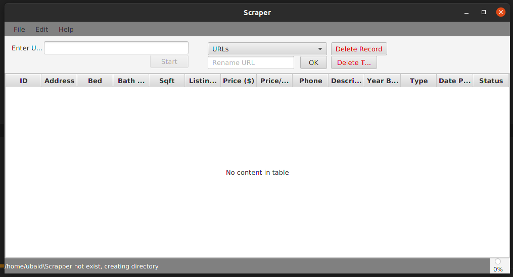

## What it is
- It is a zillow scrapper which scrap adds from the Zillow.com and store them in csv/excel files as well as stored them in MongoDB

## OS
- Currently, it is for windows OS

## How to run
- mvn clean package -DskipTests
- java -jar  ZillowScrapperApp-0.1.jar

## Demo
- 